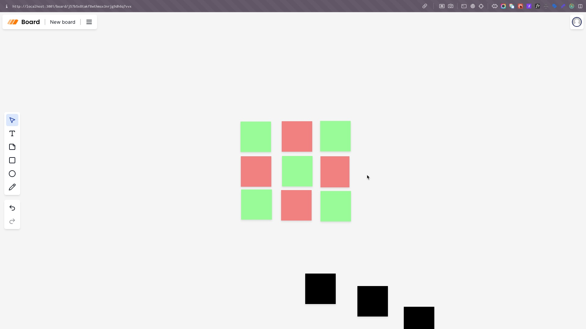

# Miro Board



It is a collaborative whiteboard application that allows users to draw, write, and chat with each other in real-time. It is built using NextJs, Convex and Liveblocks.

## Local Development

copy the `.env.example` file to `.env.local` and fill in the required environment variables.

```bash
cp .env.example .env.local
```

Visit [Convex](https://www.convex.dev/), [Liveblocks](https://liveblocks.io/) and [Clerk](https://clerk.com/) and create a new project to get the `CONVEX_API_KEY`, `CONVEX_SECRET_KEY`, `LIVEBLOCKS_API_KEY` and `CLERK_FRONTEND_API`.

Install the dependencies

```bash
npm install
```

Run the frontend development server

```bash
npm run dev
```

Run the backend development server in another terminal

```bash
npx convex dev
```
